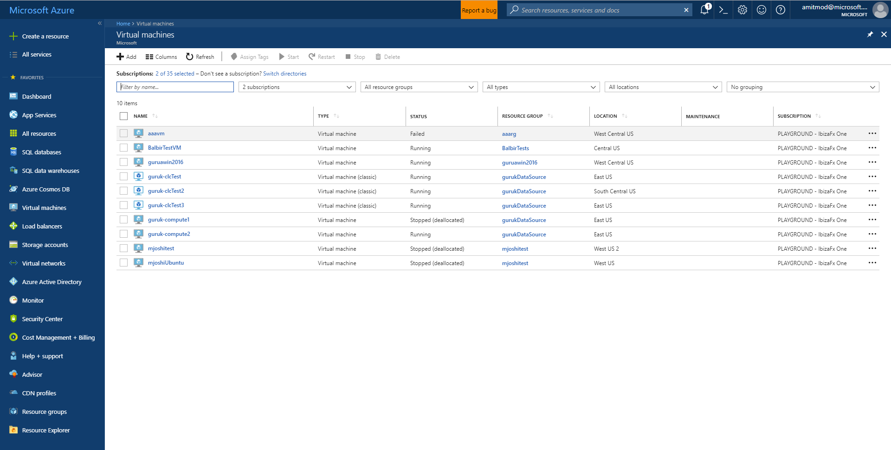

# Introduction

The [Microsoft Azure portal](https://portal.azure.com) is a central place where Azure customers can provision and manage their Azure resources. 

Azure Portal is a [single page application](https://en.wikipedia.org/wiki/Single-page_application). The parts of the page in the portal are loaded by referencing web applications, known as extensions. An extension is essentially the user experience for a service. Extensions are dynamically accessed and loaded in Azure portal based on a customer’s action in the portal. For example, when a customer clicks on Virtual machines icon in the Azure portal then the portal loads the Virtual Machine management extension. The Virtual Machine management extension provides the user experience to provision and manage Virtual Machines. 

Both first-party partners that provide services offered by Microsoft, and third-party partners that provide non-Microsoft services can quickly grow their business by getting access to a large pool of Azure portal customers by developing extensions for Azure portal.

Following is a sample image that displays [Virtual Machine extension](https://ms.portal.azure.com/#blade/HubsExtension/Resources/resourceType/Microsoft.Compute%2FVirtualMachines) is loaded in Azure portal:

